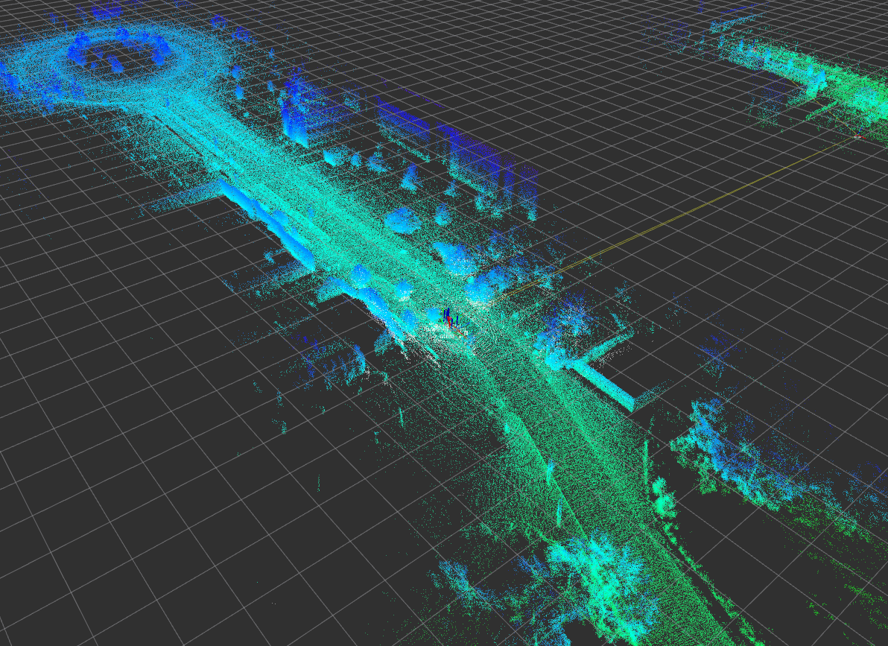
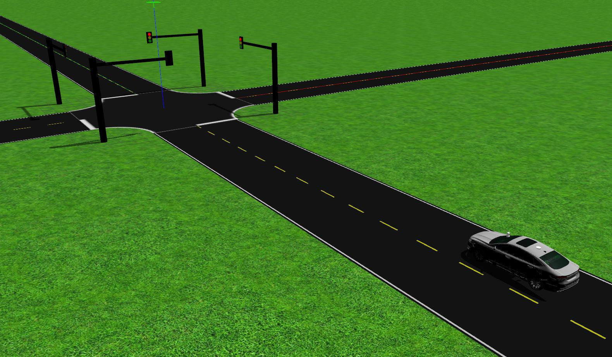
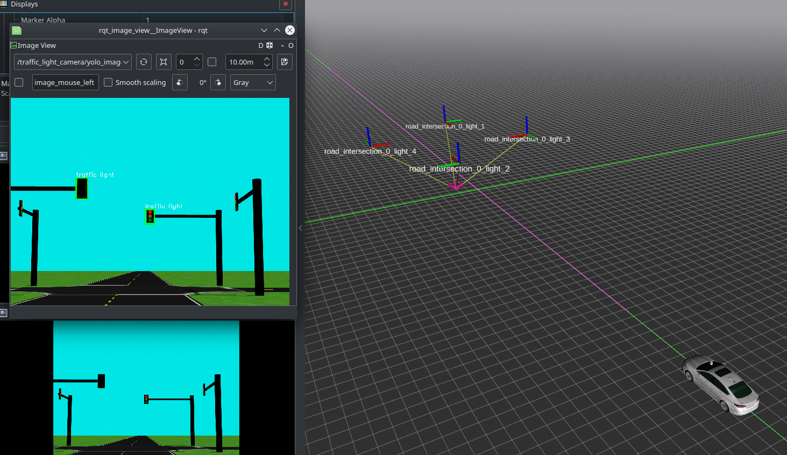
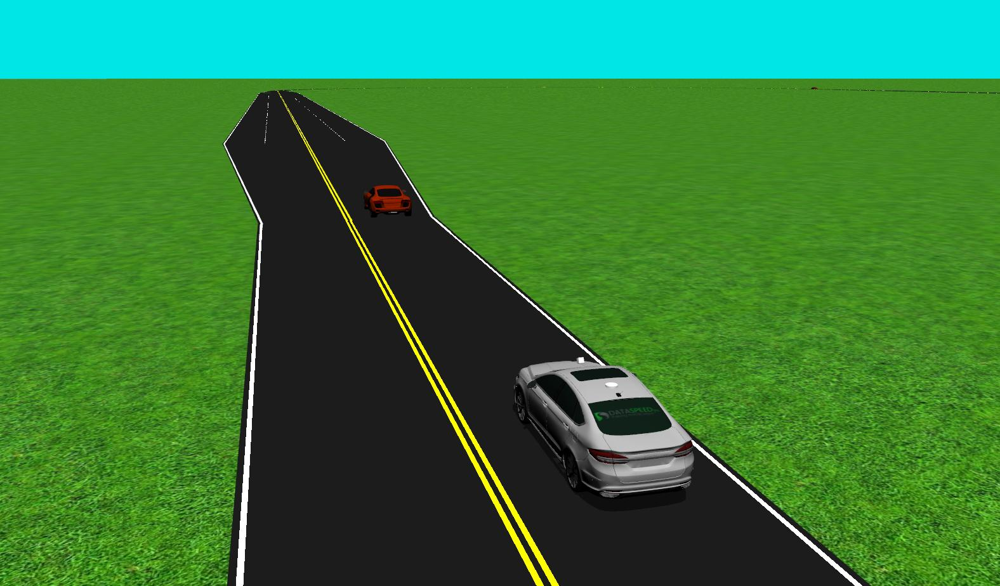
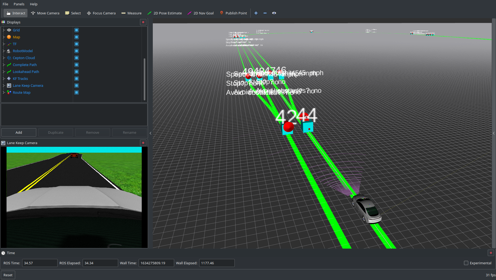

# Project Ideas for ECE 6460

This repository contains starting points and configuration for some project ideas, some involving processing real data and some involving Gazebo simulations. The bag files to use for these sample projects can be found here: [https://1drv.ms/f/s!Ar6id-4c-fy3yDMMXjcEX7lZRzkx?e=J0cv1t](https://1drv.ms/f/s!Ar6id-4c-fy3yDMMXjcEX7lZRzkx?e=J0cv1t).

The `dataset_playback` package contains a launch file with supporting configuration to play back the data from the following bag files:

- `road_data_sample.bag`
- `road_data_sample_with_labels.bag`
- `pedestrian.bag`
- `pedestrian_with_labels.bag`
- `stereo_camera_example.bag`

`dataset_playback.launch` ([dataset_playback/launch/dataset_playback.launch](dataset_playback/launch/dataset_playback.launch)) runs the necessary nodes to process the raw data from the bag and set up the TF frame tree to align all the sensor data with the vehicle body frame. It also uses the RTK GNSS position to update a TF frame from a central map frame to the vehicle body frame.

## Projects Using Real Data

### LIDAR Localization

Use real data from a 3D LIDAR sensor to construct a map of an environment, then use the map for localizing the vehicle as an alternative to GPS.

For more details, see the [project-specific README](lidar_slam_project/README.md)

### Sensor Fusion

Process data from multiple sensors to perceive better information about the environment than is possible with a single sensor.

For more details, see the [project-specific README](sensor_fusion_projects/README.md)

## Simulation Projects

### Traffic Light Detection and Control

Detect a traffic light and determine its state in Gazebo, then use that information to control the car to continue through or stop at the intersection.

For more details, see the [project-specific README](intersection_sim_project/README.md)

### Interacting with Other Vehicles

Drive around an oval track with other vehicles. There are some two-lane sections that could be used for passing...

For more details, see the [project-specific README](traffic_sim_project/README.md)

