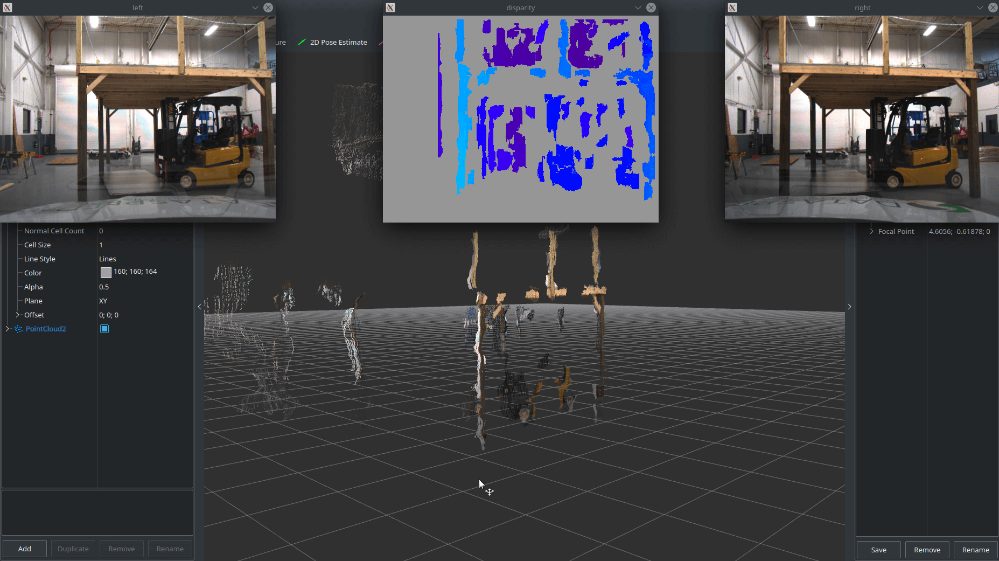

# Project Ideas for ECE 6460

This repository contains starting points and configuration for some project ideas that involve processing ROS bag files recorded from a real autonomous test vehicle. The bag files to use for these sample projects can be found here: [https://www.secs.oakland.edu/~mtradovn/ece_6460/sample_bags/](https://www.secs.oakland.edu/~mtradovn/ece_6460/sample_bags/).

The `dataset_playback` package contains a launch file with supporting configuration to play back the data from any of the bag files that are numbered datasets. `dataset_playback.launch` runs the necessary nodes to process the raw data from the bag and set up the TF frame tree to align all the sensor data with the vehicle body frame. It also uses the RTK GNSS position to update a TF frame from a central map frame to the vehicle body frame.

The numbered dataset bag files are intended for any projects involving real world data, whereas the bag files that are not numbered datasets are intended for the specific project ideas in this repository.

## LIDAR Localization


### Setup
The following four repositories must be cloned into your ROS workspace: hdl_graph_slam, hdl_localization, ndt_omp, fast_gicp
```
git clone https://github.com/robustify/hdl_graph_slam.git
git clone https://github.com/robustify/hdl_localization.git
git clone https://github.com/koide3/ndt_omp.git
git clone https://github.com/SMRT-AIST/fast_gicp.git --recursive
```
After cloning the repositories, install binary packages they depend on by running `deps.bash` from the root folder of the workspace. Finally, compile your ROS workspace with `release.bash`.

Download `campus_drive_083019.bag` to your computer.

### Build a Map
Start up the map building software:
```
roslaunch lidar_slam_project build_map.launch
```
Play the bag file to start building the map. Depending on the capability of your CPU, you might have to play the bag at a slower rate. 
```
rosbag play --clock campus_drive_083019.bag -r 0.75
```

### Save Map
Call the map save service to save the map to a `.pcd` point cloud file:
```
rosservice call /hdl_graph_slam/save_map
```

### Localize on the Map
Stop the map building software and bag playback. Move the saved point cloud file and its corresponding `.utm` file into the `data` folder inside the `hdl_localization` package. Then, start the localization software:
```
roslaunch lidar_slam_project lidar_localization.launch
```
Play the same `campus_drive_083019.bag` file again. In Rviz, click the "2D Pose Estimate" button, then click where the vehicle starts on the map, drag in the direction of the way the vehicle is facing, and let go. This initializes the localization estimate.

## Camera / LIDAR Fusion


Download `cepton_camera_fusion.bag` to your computer. Start the software:
```
roslaunch camera_lidar_project cepton_camera_fusion.launch
```
Then play the bag file:
```
rosbag play --clock cepton_camera_fusion.bag
```

## Stereo Camera Processing (More Info Soon)


Download the `stereo_camera_example.bag` to your computer. Start the software:
```
roslaunch stereo_camera_project stereo_camera_driver.launch
```
Then play the bag file:
```
rosbag play --clock stereo_camera_example.bag
```

## RADAR / LIDAR Fusion


Download `complete_dataset_1.bag` to your computer and launch the playback software:
```
roslaunch dataset_playback dataset_playback.launch
```
Then play the bag file:
```
rosbag play --clock complete_dataset_1.bag
```
In Rviz, the pink, blue, and white point clouds are the raw scan data from three different LIDAR sensors. The green boxes are objects detected by the RADAR, and the red arrows visualize the relative velocity of the objects as measured by the RADAR.
