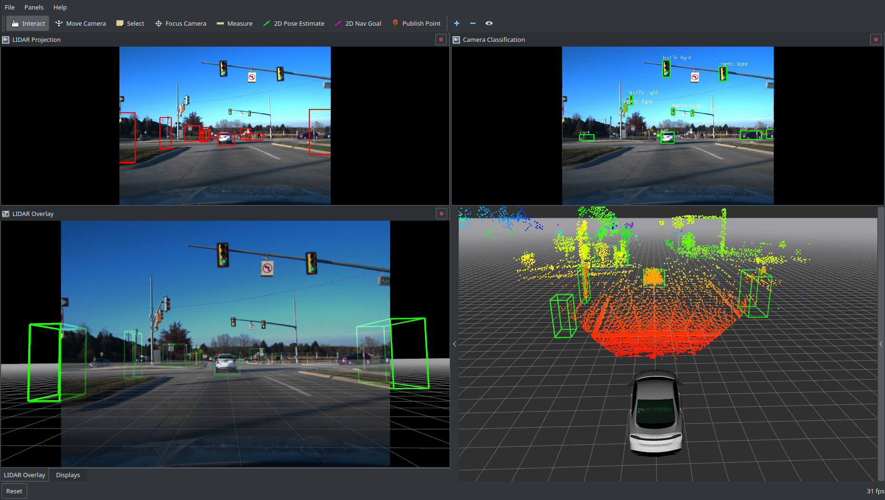
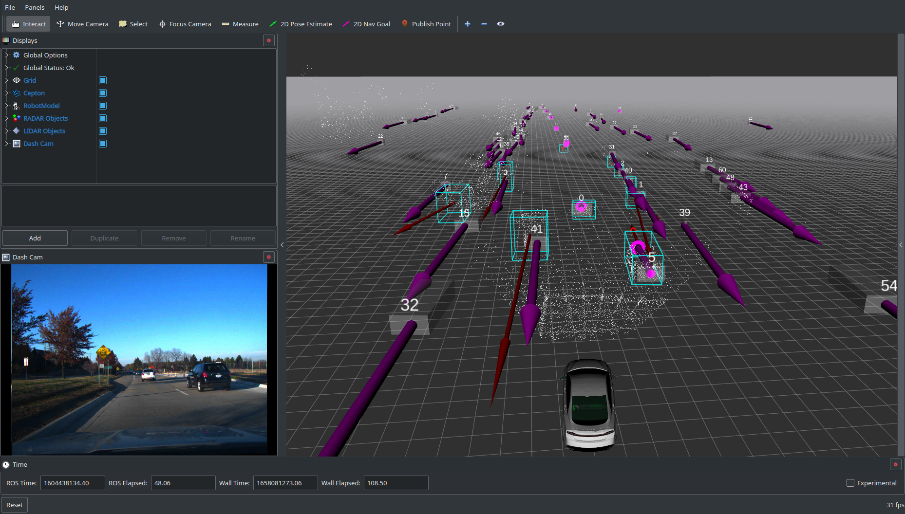

# Project Ideas for ECE 6460

This repository contains starting points and configuration for some project ideas that involve processing ROS bag files recorded from a real autonomous test vehicle. The bag files to use for these sample projects can be found here: [https://1drv.ms/f/s!Ar6id-4c-fy3rAeC7-dnhQGdWy6h](https://1drv.ms/f/s!Ar6id-4c-fy3rAeC7-dnhQGdWy6h).

The `dataset_playback` package contains a launch file with supporting configuration to play back the data from any of the bag files that are numbered datasets. `dataset_playback.launch` runs the necessary nodes to process the raw data from the bag and set up the TF frame tree to align all the sensor data with the vehicle body frame. It also uses the RTK GNSS position to update a TF frame from a central map frame to the vehicle body frame.

The numbered dataset bag files are intended for any projects involving real world data, whereas the bag files that are not numbered datasets are intended for the specific project ideas in this repository.

## Projects Using Real Data

### LIDAR Localization


INTRO HERE

### Camera / LIDAR Fusion


INTRO HERE

[More Info](camera_lidar_project/README.md)

### Stereo Camera Processing (More Info Soon)


[More Info](stereo_camera_project/README.md)

### RADAR / LIDAR Fusion



Download `road_data_sample.bag` to your computer and launch the playback software:
```
roslaunch dataset_playback dataset_playback.launch
```
Then play the bag file:
```
rosbag play --clock road_data_sample.bag
```
In Rviz, the pink, blue, and white point clouds are the raw scan data from three different LIDAR sensors. The green boxes are objects detected by the RADAR, and the red arrows visualize the relative velocity of the objects as measured by the RADAR.
