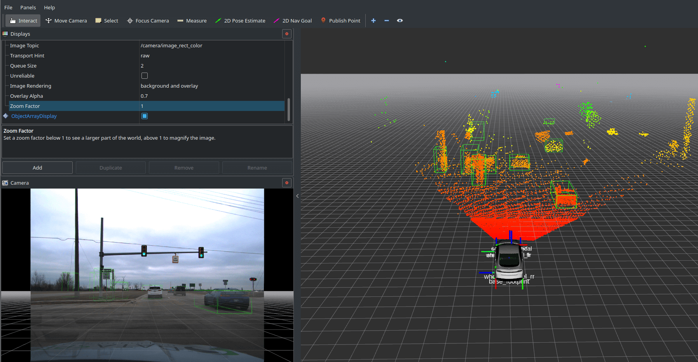

# Camera / LIDAR Fusion


## Quick-Start Guide
To run the system as shown in the screenshot above and to start exploring the system, first download either `road_data_sample_with_labels.bag` or `pedestrian_with_labels.bag` to your computer. Then, start the software:
```
roslaunch camera_lidar_project camera_lidar_fusion.launch
```
Then play the bag file:
```
rosbag play --clock road_data_sample_with_labels.bag
```

