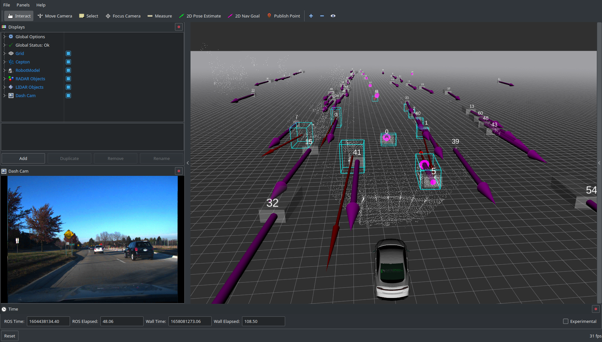

# Camera / LIDAR Fusion


## Quick-Start Guide

To run the system as shown in the screenshot above and to start exploring the system, first download `road_data_sample_with_labels.bag` to your computer. Then, start the software:
```
roslaunch sensor_fusion_projects camera_lidar_fusion.launch
```
Then play the bag file:
```
rosbag play --clock road_data_sample_with_labels.bag
```

In Rviz, the image on the left side of the screen renders the 3D green wireframes seen on the right side of the screen over the camera image according to the TF transform between the LIDAR and the camera.

The top left image shows an image where the 3D LIDAR boxes are projected into 2D regions-of-interest in the image.

The top right image shows neural network classifications of objects in the image.

## Ideas

Here are some ideas for things that can be investigated.

### *Investigate methods of associating classification labels with LIDAR boxes*

Playing back the road data sample will show that the LIDAR bounding boxes can be noisy and tends to detect and track things on the side of the road like guard rails and road signs. It could be useful to make use of the camera data to tell which LIDAR boxes are things of interest, like people, cars, animals, etc.

There are two viable strategies to do this: perform processing in the image domain, or 3D domain. Image domain means using the red ROI boxes from the top left image and comparing them to the green boxes in the upper right image to determine correspondence. 3D domain means projecting the green classification boxes out into the 3D world and seeing where they intersect with LIDAR data.

### *Focus on pedestrian detection and tracking*

You can download a different bag file called `pedestrian_with_labels.bag` in which the vehicle is stationary and a pedestrian walks around in front of the vehicle, and goes in and out of view. Using the classification label of 'person', perhaps a different object tracking model could be implemented or optimized?

### *Implement a traffic light state detector*

Using the classification labels, try to determine the current state of the traffic light for anything that is classified as a traffic light. Then, get a little more picky and try to only detect the state of the traffic light over the vehicle's lane.

In a real situation, a narrower field-of-view camera should be used to get better resolution of the traffic light. Don't worry about detecting the light state after it is too late to act.

### *Run neural network classification live instead of using pre-labelled data*

The `road_data_sample_with_labels.bag` file contains all object classification data a priori in case it is not possible or desired to run the neural network live. However, it is possible to run the network live. Instead of downloading the bag with the label data embedded in it, download `road_data_sample.bag` or `pedestrian.bag`.

To run the network, you will need to clone this repository: [https://github.com/robustify/yolo_classification.git](https://github.com/robustify/yolo_classification.git). You will also need to follow the instructions in that repository's README for how to install CUDA, and how to compile and configure the neural network library. Also, running the network is only possible if you have a discrete NVIDIA GPU in your computer.

# RADAR / LIDAR Fusion


## Quick-Start Guide

First, start the software:
```
roslaunch sensor_fusion_projects radar_lidar_fusion.launch
```
Then play the bag file:
```
rosbag play --clock road_data_sample_with_labels.bag
```

In Rviz, the green boxes are object data directly reported by the RADAR over CAN. The blue boxes are segmented and tracked objects from the LIDAR. The red arrows visualize the relative velocity of the objects. The length of the arrow represents a projection of one second of relative velocity.

## Ideas

Here are some ideas for things that can be investigated.

### *Investigate merging corresponding objects into one track*

As seen in Rviz, the LIDAR boxes and RADAR boxes sometimes correspond to each other. The RADAR can detect objects at much farther range and directly measure the relative velocity, but LIDAR provides richer and more accurate range data up close. By combining the object tracks between these two sensors, the benefits of both can be realized.
