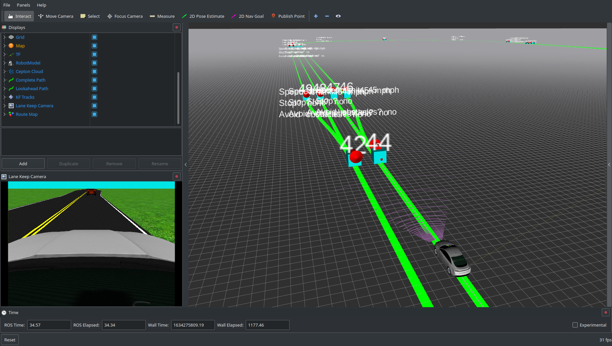

# Traffic Sim Project



## Quick-Start Guide

To run the simulation, run the following launch command:
```
roslaunch traffic_sim_project sim_launch.launch
```
The vehicle will automatically drive around the loop using the programmed route shown as the green line in Rviz. It will avoid colliding with the other traffic vehicle encountered around the first bend, but if only there were some way to avoid being stuck behind the slow-poke...

The programmed routes for the ego vehicle and the traffic vehicles can be customized by modifying the simulation configuration file ([yaml/oval_world_scenario.yaml](yaml/oval_world_scenario.yaml)).

The route sequence lists describe the order of map nodes to traverse, as well as the target speed for that segment. To see where each of the node IDs are to modify the routes, activate the 'Route Map' display in Rviz, which will show the markers in the above screenshot. The markers show the geometry of the routes, the location and orientation of the nodes, and a text marker with the ID number.

Traffic vehicles can be added or removed by simply copying or deleting an entire list entry under `traffic_vehicles`. Traffic vehicles spawn at the first node ID in the route sequence list, and when they reach the end, they teleport back to the first node. They will sit still until the ego vehicle comes close enough to them, as specified in the `start_dist` parameter.

## Ideas

Here are some ideas for things that can be investigated with this simulation.

### *Implement vision-only lane keeping*

Instead of following the programmed route, try to use just the camera to detect the lane markings and then steer to the middle. This is relatively easy when there are two parallel lines, but how to deal with the merges?

### *Pass slow-moving vehicles*

While following the programmed route, determine if there is a lane available for passing and execute a lane change maneuver to pass. White dashed lines are the only lines that should be crossed...
